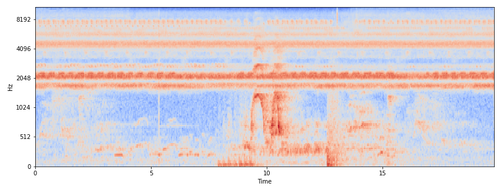

# animal-sounds

 

This repository provides an end-to-end audio classification pipeline for detecting animal vocalizations in wildlife recordings. It includes audio preprocessing, feature extraction, optional synthetic data generation, classifier training, evaluation, and prediction. The workflow was developed for chimpanzee vocalizations but can be adapted to other species with labeled audio.

## Documentation

The detailed project documentation, tutorials and results are on the [project website](https://utrechtuniversity.github.io/animal-sounds)

- [Project overview](https://utrechtuniversity.github.io/animal-sounds)
- [Methods](https://utrechtuniversity.github.io/animal-sounds/methods)
- [Model training workflow](https://utrechtuniversity.github.io/animal-sounds/workflow)
- [Prediction workflow](https://utrechtuniversity.github.io/animal-sounds/prediction)
- [Model comparison](https://utrechtuniversity.github.io/animal-sounds/notebooks/model_comparison)

## Built with

- [Python >=3.12](https://www.python.org/)
- [Sklearn ~1.7.0](https://scikit-learn.org/)
- [Numpy ~2.2.6](https://numpy.org/)
- [Pandas ~2.3.0](https://pandas.pydata.org)
- [torch~2.6.0](https://pytorch.org) 
- [torchaudio~2.0.2](https://docs.pytorch.org/audio/stable/index.html)
- [torchlibrosa~0.1.0](https://github.com/qiuqiangkong/torchlibrosa)

## Model performance (Macro Average Recall)

| Trained on| Recorder |SVM | CNN10 | 
|  --- | --- | --- |--- |
| Sanctuary | a | 0.62 | 0.81 |
| Sanctuary + Synthetic | a | 0.75 | 0.93 | 
| Sanctuary | b | 0.60 | 0.84 |
| Sanctuary + Synthetic | b | 0.78 | 0.92 | 

## Project scope

- SVM and CNN classifier families are supported.
- The pipeline is designed for cross-environment generalization.
- Synthetic data generation is available for target-domain robustness.

## Pre-trained models

Trained CNN10 and CNN12 chimpanzee vocalization classifiers are published on Hugging Face Hub, ready to use without retraining:

| Model | Training data | Hugging Face |
|---|---|---|
| CNN10 | Sanctuary + synthetic (recommended) | [utrechtuniversity/chimp-vocalization-cnn10-synthetic](https://huggingface.co/utrechtuniversity/chimp-vocalization-cnn10-synthetic) |
| CNN10 | Sanctuary only | [utrechtuniversity/chimp-vocalization-cnn10-sanctuary](https://huggingface.co/utrechtuniversity/chimp-vocalization-cnn10-sanctuary) |
| CNN12 | Sanctuary + synthetic (recommended) | [utrechtuniversity/chimp-vocalization-cnn12-synthetic](https://huggingface.co/utrechtuniversity/chimp-vocalization-cnn12-synthetic) |
| CNN12 | Sanctuary only | [utrechtuniversity/chimp-vocalization-cnn12-sanctuary](https://huggingface.co/utrechtuniversity/chimp-vocalization-cnn12-sanctuary) |

Each model repo includes trained weights, a standalone `modeling.py` (no need to install this package), a standalone `preprocess.py` reproducing the exact training-time feature extraction, and cross-environment evaluation results. See the model cards on Hugging Face for architecture details, training data, and usage examples.

## Contact

[Joeri Zwerts](https://www.uu.nl/medewerkers/JAZwerts) - j.a.zwerts@uu.nl

[Research Engineering team](https://utrechtuniversity.github.io/research-engineering/) - research.engineering@uu.nl

Project Link: [https://github.com/UtrechtUniversity/animal-sounds](https://github.com/UtrechtUniversity/animal-sounds)

### Relevant publications

- Introducing a central african primate vocalisation dataset for automated species classification.\ 
Zwerts, J. A., Treep, J., Kaandorp, C. S., Meewis, F., Koot, A. C., & Kaya, H. (2021).\ 
[arXiv preprint](https://arxiv.org/pdf/2101.10390.pdf)
- The INTERSPEECH 2021 Computational Paralinguistics Challenge: COVID-19 cough, COVID-19 speech, escalation & primates.\
Schuller, B. W., Batliner, A., Bergler, C., Mascolo, C., Han, J., Lefter, I., ... & Kaandorp, C. (2021).\
[arXiv preprint](https://arxiv.org/pdf/2102.13468.pdf)
- ​Zwerts, J., Treep, J., Zahedi, P., & Kaandorp, C. (2024). Central African Primate vocalization bioacoustics dataset: Yoda Data publication platform of Utrecht University. 

<!-- CONTRIBUTING -->
## Contributing

Contributions are what make the open source community an amazing place to learn, inspire, and create. Any contributions you make are **greatly appreciated**.

To contribute:

1. Fork the Project
2. Create your Feature Branch (`git checkout -b feature/AmazingFeature`)
3. Commit your Changes (`git commit -m 'Add some AmazingFeature'`)
4. Push to the Branch (`git push origin feature/AmazingFeature`)
5. Open a Pull Request

