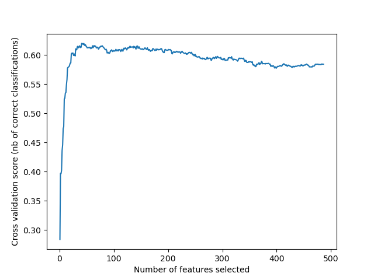

# 3_classifier

## Table of Contents

- [How does it work](#how-does-it-work)
- [Software dependencies](#software-requirements)
- [Usage](#basic-usage)
    - [Train](#train)
    - [Predict](#predict)
    - [Shell script](#shell-script)
- [Remarks](#remarks)

## How does it work
To train the model using `train.py` the user needs have converted audio data into [features](/bioacoustics/2_feature_extraction).

## SVM

### Data Segmentation
The labeled sections of audio signal from the steps above are then split into frames of 0.5 seconds length with 0.25 seconds overlap. 


### Feature selection (SVM)
In the case of running SVM models using `train.py`, features are selected in the preprocessing steps of the script. We did a small experiment to determine an optimal number of features.
With the total of 1140 acoustic features from the training samples as input, we used a Recursive Feature Elimination (RFE) technique to determine an optimal number of features. This technique yielded a broad optimum with centered a round a rough estimate of 50 features.
|  | 
|:--:| 
| *Recursive Feature Elimination on training dataset* |

In the preprocessing steps of the SVM model, we perform feature selection using [Extra Trees Classifier](https://scikit-learn.org/stable/modules/generated/sklearn.ensemble.ExtraTreesClassifier.html) to rank the features and select the 50 most important features. We save this ranking to select the same features for training and precition.

## CNN
### Data Segmentation

#### Training

During training, a random cropping strategy was employed. Each training sample was generated by selecting a random temporal window of 64 frames from a full-length spectrogram. File selection was weighted by both inverse class frequency and recording length to address class imbalance and ensure proportional sampling across files of varying duration. The number of random crops per epoch (samples per epoch) was set to 11,200, which was empirically found to provide the best generalization performance. This random cropping serves as implicit data augmentation, as the model encounters different temporal segments of each recording at every epoch.

#### Evaluation

During evaluation, each recording was divided into non-overlapping sequential chunks of 64 frames. The final chunk of each recording was zero-padded if shorter than 64 frames. Chunk-level predictions were aggregated to file-level predictions by averaging the predicted probabilities across all chunks belonging to each file (mean aggregation). A fixed classification threshold of 0.5 was applied to the file-level positive class probability, corresponding to an argmax decision rule, to ensure environment-agnostic deployment without per-site threshold calibration.

### Data Augmentation

SpecAugment (Park et al., 2019) was applied to each training batch to improve model robustness. The augmentation consisted of two frequency masks of up to 8 mel bins each and two time masks of up to 10 frames each, applied with a probability of 0.7 per sample. This forces the model to avoid reliance on narrow frequency bands or specific temporal positions, which is particularly relevant for cross-environment generalization where environment-specific spectral signatures could otherwise be memorized.

### Model Architecture

A 10-layer convolutional neural network (CNN10) was used as the classifier. The architecture consists of four convolutional blocks, each containing two convolutional layers with 3×3 kernels and same padding, followed by batch normalization, ReLU activation, average pooling with a 2×2 kernel, and dropout. The number of filters doubles at each block: 64, 128, 256, and 512. After the final convolutional block, global average pooling reduces the feature maps to a 512-dimensional vector, which is passed through a fully connected layer with ReLU activation and dropout, followed by a final linear layer with 2 output units corresponding to the background and chimpanzee classes. Weights were initialized using He normal initialization. We also evaluated a 12-layer variant (CNN12) with an additional convolutional block.

### Training Configuration

The model was trained using the AdamW optimizer with a learning rate of 1e-4, weight decay of 1e-3, and a batch size of 32 for 20 epochs. A dropout rate of 0.5 was applied throughout the network, and a max-norm weight constraint of 4 was enforced on all layers. A ReduceLROnPlateau learning rate scheduler monitored validation F1 score, reducing the learning rate by a factor of 0.5 after 2 epochs without improvement, with a minimum learning rate of 1e-6. The model checkpoint with the highest validation F1 score was retained for evaluation. The loss function was standard cross-entropy.


## Software requirements

- Python>= 3.12
- [Sklearn ~1.7.0](https://scikit-learn.org/)
- [Numpy ~2.2.6](https://numpy.org/)
- [Pandas ~2.3.0](https://pandas.pydata.org)
- [torch~2.6.0](https://pytorch.org) 
- [torchaudio~2.0.2](https://docs.pytorch.org/audio/stable/index.html)
- [torchlibrosa~0.1.0](https://github.com/qiuqiangkong/torchlibrosa)
    
## Basic usage


### Train

Use this to train a new model on your labeled dataset. The trained model will be saved for later use.
```
python bioacoustics/classifier/train.py --config_file "config/testdata.yml"

```

### Evaluate
Use this after training to assess model performance on a labeled test set. It returns metrics such as F1 score, precision, and recall. Requires ground truth labels.

```
python bioacoustics/classifier/evaluate.py --config_file "config/testdata.yml"
```
### Predict
Use this to run the model on new, unlabeled recordings where you just want to get predictions. No ground truth labels are needed.
```
python bioacoustics/classifier/predict.py --config_file "config/testdata.yml"
```


