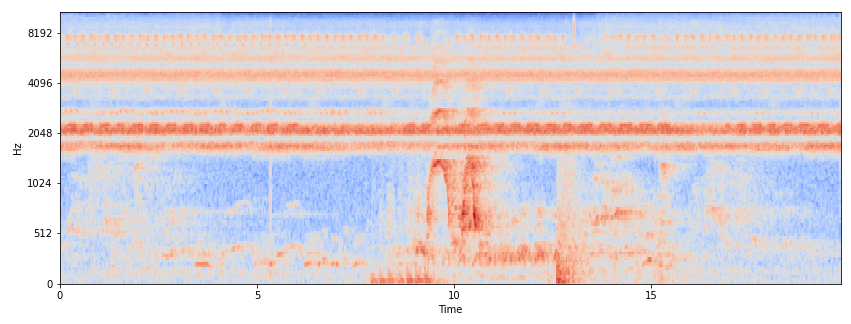

# Feature extraction

The modules in this directory are used to extract acoustic and/or deep learning features from '.wav' files. The features are used as input for the classifier ([step 3](../3_classifier)).

## Instructions

[Installation instructions](https://github.com/UtrechtUniversity/animal-sounds#getting-started)

### Feature extraction for Support Vector Machines
We extract several feature sets using:

- a [python version](https://github.com/mystlee/rasta_py) of the [rasta-mat](https://www.ee.columbia.edu/~dpwe/resources/matlab/rastamat/) library.
- an [Automatic Analysis Architecture](https://doi.org/10.5281/zenodo.1216028)

For our analyses we chunk all recordings into 0.5 second frames (with 0.25 second overlap between the chunks).
We apply a Butterworth bandpass filter for filtering audio between 100 and 2000 before extracting features. 
We create MFCC and RASTA-PLPC low level descriptors (LLDs) from the filtered signal. For each horizontal band of the MFCC and RASTA-PLPC representation we calculate $\Delta$ and $\Delta^2$, and extract statistical features from the plain LLDs, $\Delta$ and $\Delta^2$.

We extend the feature set with the features from an [Automatic Analysis Architecture](https://doi.org/10.5281/zenodo.1216028)

The script results in a feature set of 1140 features per audio frame.

### Running the script
Use shell script `run_svm.sh` to start `extract_features_svm.py` from the command line. The following arguments should be specified:
- `--input_dir`; directory where the '.wav' files are located.
- `--output_dir`; directory where the feature files ('.csv') should be stored.
- `--frame_length`; subdivide '.wav' files in frames of this length (in number of samples, if the sample rate is 48000 samples per second, choose e.g. 24000 for 0.5 second frames)
- `--hop_length`; overlap between frames in number of samples per hop
- `--filter`; butter bandpass filter variables 

In `./config` the user can specify which features to extract.

### sndfile library
If you get an error saying something about a 'snd_file' dependency on an ubuntu machine, this can be fixed by installing the following C library:
```
sudo apt-get install libsndfile-dev
```
## Feature extraction for Convolutional Neural Network (CNN)
To extract audio features for CNN classifier, .wav files are converted to Log-mel Spectrograms using [librosa](https://zenodo.org/badge/latestdoi/6309729) library. 
Log- Melspectrograms had the best results in [[1]](#ref). As a future work we can try others such as Log-Spectrograms, and Gammatone-Spectrogram.

In this process, first we apply butter_bandpass filter to select frequencies among 100, 2000 hz. Then the short time Fourier transform (STFT) is applied on time-domain waveforms to calculate spectrograms. 
Then mel filter banks are applied on the spectrograms followed by a logarithmic operation to extract log mel spectrograms. 

|  | 

### Running the script
Open a command line and run the following command:
```
sh run_dl.sh
```

This command applies `extract_features_dl.py` on the whole dataset. The following arguments should be specified:
- `--input_dir`; directory where the '.wav' files are located.
- `--output_dir`; directory where the feature files ('.pkl') should be stored.
- `--label`; the label of the wav file, i.e. chimpanze or background
- `--window_length`; subdivide '.wav' files in frames of this length (in number of samples, in our case, the sample rate is 48000 samples per second, we chose 750 for 15-millisecond frames)
- `--hop_length`; overlap between frames in number of samples per hop (in our case, the sample rate is 48000 samples per second, we chose 376)
- `--new_img_size`; the number of rows and columns of the log-melspectrograms which is ingested as an image to cnn.

## <a name="ref"></a>References
1. K. Palanisamy,D. Singhania†, and A. Yao,"Rethinking CNN Models for Audio Classification",2020 
   [arXiv preprint](https://arxiv.org/abs/2007.11154), [github](https://github.com/kamalesh0406/Audio-Classification)